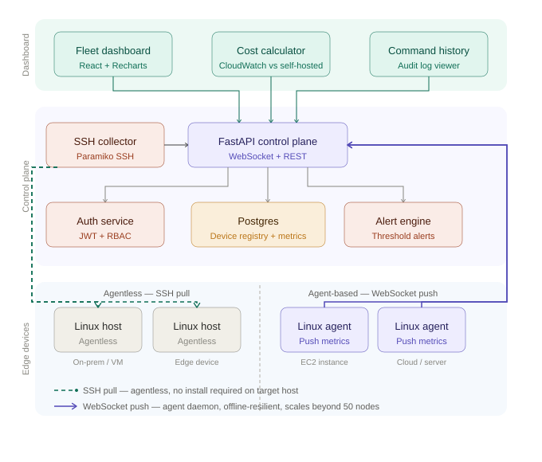

# Linux Fleet Manager

Self-hosted Linux fleet management platform supporting 50+ devices 
across EC2, on-prem, and edge environments.

## Status
🚧 Active development — targeting completion August 2026

## What it does
- Dual-mode monitoring: agentless SSH pull (Paramiko) and 
  agent-based WebSocket push
- Real-time metric streaming from /proc and /sys
- Offline-resilient command queue backed by Postgres
- JWT auth with admin/viewer RBAC
- Cost-effective alternative to AWS CloudWatch 
  (~95% lower cost for 50+ device fleets)

## Stack
Python · FastAPI · PostgreSQL · WebSocket · Paramiko · SQLAlchemy

## Architecture

Two monitoring modes connect to a shared control plane:
- **SSH pull** — control plane SSHes into Linux hosts via Paramiko. 
  No software installed on target. Works on locked-down corporate VMs.
- **WebSocket push** — lightweight agent daemon streams metrics. 
  Offline-resilient, works behind NAT, scales beyond 50 nodes.